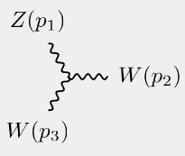
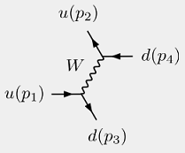
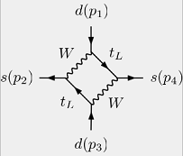

#  
[](https://github.com/docbrown1955/marty-public/releases) [](https://github.com/docbrown1955/marty-public/commits/master)
[](https://github.com/docbrown1955/marty-public/actions)
[](https://github.com/docbrown1955/marty-public/stargazers)


## Summary

`MARTY` is a C++ program automating perturbative calculations for beyond the Standard Model scenarios.
Models can be built using the C++ user interface. For any model, squared amplitudes and Wilson coefficients
can be calculated at the tree level or the one-loop level.

`MARTY` is a code generator. Analytical expressions, squared amplitudes or Wilson coefficients are
converted into C++ code in a self-contained library compiled independently of `MARTY`.
This code can therefore be used for numerical evaluation in different scenarios to perform a
phenomenological analysis.

More information can be found on the [website](https://marty.in2p3.fr). In case you use MARTY for a physics study please cite

MARTY - A C++ framework automating symbolic calculations Beyond the Standard Model
(Comput. Phys. Commun. [264 (2021) 107928](https://linkinghub.elsevier.com/retrieve/pii/S001046552100062X), arXiv: [2011.02478](https://arxiv.org/abs/2011.02478) [hep-ph])

## Get Started

In the following some possibilities to get started easily with `MARTY`, once installed, are presented. For installation instructions, see the following section.

Several sample programs are given in the `examples/` directory, each in a different model. 
Once `MARTY` has been built, it is possible to run any example from the `build/examples/` directory.

 - **Complete first example \[`gettingStarted`\]:** Extended first view at `MARTY` features, explained in details on the [website](https://marty.in2p3.fr/gettingStarted.html). This example is simple but rather complete, from model building to code generation.
 - **Simple models and calculations \[`sampleScalar`, `sampleSQED`, `sampleQED`\]:** Get a first simple view of model building in `MARTY` and how to perform simple amplitude calculations.
 - **More complexity \[`sampleQCD`\]:** Group representations and cross-section calculation.
 - **First glance at Wilson coefficients \[`sample2HDM`\]**.

Here are example diagrams you can try to find running the sample programs !
| Simple 3-vertex | Weak diffusion | Meson mixing |
------------------|----------------|-----------|
|  |   |  |

For further `MARTY` magic, checkout the comprehensive [manual](https://marty.in2p3.fr/doc/marty-manual.pdf)!
## Installation

The following procedure is relevant since `MARTY-1.6`. To build and install older versions please refer to the [website](https://marty.in2p3.fr/download.html).

### Dependencies

Since `MARTY-1.6` the dependency installations are longer supported by the automated build procedure, it is the user responsibility to install the required dependencies on his/her particular system.

Library dependencies (needed at compile-time):
 - `Qt5` (needed for the `GRAFED` Graphical User Interface)
 - `GSL` + `GSLCBLAS` (C numerical scientific library)

System dependencies (needed at run-time as system commands):
 - `cmake`
 - `latex`
 - `lualatex`
 - `dvipng`
 - `convert` (part of `ImageMagick`)

 On `Ubuntu` for example these dependencies can be installed with
 ``` bash
    sudo apt-get install libgsl-dev libgslcblas0 texlive texlive-luatex dvipng coreutils imagemagick -y
    sudo apt-get install qtbase5-dev  qtbase5-dev-tools qtchooser qt5-qmake qtbase5-dev-tools -y
    sudo apt-get install cmake -y
 ```
 On `MacOS`
 ``` bash
    brew install coreutils gsl qt@5 gcc@12 cmake imagemagick texlive
 ```

### Compilers for `MARTY`

MARTY links C++ code with Fortran code from the [LoopTools](http://www.feynarts.de/looptools/) library.
MARTY takes care of compiling and linking `LoopTools` but the compilers must be chosen carefully to link C++ and fortran codes.

For this reason, the MARTY installation procedure requires to have the GNU compiler collection, version greater than 11. Furthermore, the versions of `gcc/g++/gfortran` should be the same. The minimal set of compilers required to compile `MARTY` is therefore
```
    gcc-11
    g++-11
    gfortran-11
```

If the default compilers on the system do not meet the above requirements, compilers must be explicitely defined before going further following:
``` bash
    export CXX=g++-11
    export CC=gcc-11
    export FC=gfortran-11
```

#### Compiler Compatibility Table

The below table shows the combinations of Platform/Compiler validated with the latest version of `MARTY`.
For a detailed and up-to-date documentation on how to build `MARTY` on these platforms, refer to the workflow file in the `.github/` folder containing build instructions for each.

**Legend:**
- ✅ Validated
- 🔶 Expected to work (not validated)
- ❌ No compatibility guaranteed

| Platform             | GCC 11 | GCC 12 | GCC 13 | GCC 14 | Clang 18 (libstdc++/14) |
|----------------------|--------|--------|--------|----------|----------|
| Ubuntu 22.04         | ✅     | ❌     | ❌     | ❌       |   ❌   |
| Ubuntu 24.04         | ❌     | ❌     | 🔶     | ✅       |   ✅   |
| macOS 14             | ❌     | ✅     | 🔶     | 🔶       |   ❌   |

### Build and install `MARTY`

Once the dependencies have been installed and that the `C`, `C++` and `Fortran` compilers meet the requirements above (either by default or after having exported the `CC`, `CXX` and `FC` environment variables), clone this repository:
```bash
    git clone https://github.com/docbrown1955/marty-public.git
```
Then, build and install `MARTY`!
``` bash
    cd marty-public
    mkdir build
    cd build
    cmake .. -DCMAKE_BUILD_TYPE=Release -DCMAKE_INSTALL_PREFIX=<installation-path-for-marty>
    make
    make install
```

If the `CMAKE_INSTALL_PREFIX` is not given, `cmake` will automatically set this variable to `/usr/local`. In case the installation path is not in `/home` (on Unix systems), the installation command requires `sudo`:
``` bash
    sudo make install
```

It is also possible to build `MARTY` in debug mode (without optimization and including debug symbols) using the option `-DCMAKE_BUILD_TYPE=Debug` instead.

### Run tests

To run the tests simply type:
``` bash
    ctest
 ```
It is possible to get the output of failed tests (e.g. to include in a bug fix request) using
``` bash
    ctest --output-on-failure
```


## Environment variables

In case `MARTY` is not installed in a standard location (not in `/usr/local/`) it is necessary to set properly environment variables. Given that the installation path is `<install/path>`, Linux users should add this in their `${HOME}/.bashrc` file:

``` bash
    export PATH=$PATH:<install/path>/bin
    export CPATH=$CPATH:<install/path>/include
    export C_INCLUDE_PATH=$C_INCLUDE_PATH:<install/path>/include
    export LIBRARY_PATH=$LIBRARY_PATH:<install/path>/lib
    export LD_LIBRARY_PATH=$LD_LIBRARY_PATH:<install/path>/lib
```

Although not recommended, if MacOS users install MARTY in a non-standard location the appropriate environment variables are (also to put in `${HOME}/.bashrc`)

``` bash
    export PATH=$PATH:<install/path>/bin
    export CPATH=$CPATH:<install/path>/include
    export C_INCLUDE_PATH=$C_INCLUDE_PATH:<install/path>/include
    export LIBRARY_PATH=$LIBRARY_PATH:<install/path>/lib
    export DYLD_LIBRARY_PATH=$DYLD_LIBRARY_PATH:<install/path>/lib
```

After the first installation (and adding the environment variables in the `.bashrc` file) it is necessary to launch a new terminal or reload the bash session:

``` bash
   source ${HOME}/.bashrc
```

## The specific case of `MacOS`

On `MacOS` the System Integrity Protection (SIP) can cause issues if files are not installed in `/usr/local`. We therefore recommand to install `MARTY` in this location (default):
``` bash
    mkdir build
    cd build
    cmake ..
    make
    sudo make install
```

## In case of trouble installing `MARTY`

In you have issues to install dependencies or build `MARTY`, please see the open and closed [issues](https://github.com/docbrown1955/marty-public/issues). If not one solves your problem, open a new issue describing the bug:
 - Which operating system (including the version)
 - Provide a clear description of the procedure followed before the bug happened
 - Copy the error message if any
